<div align="center">

# 🫀 Cardio-Monitor

### AI-Powered Heart Disease Prediction System

[](https://www.python.org/)
[](https://flask.palletsprojects.com/)
[](https://scikit-learn.org/)
[](https://opensource.org/licenses/MIT)


**Early detection saves lives. Know your heart health risk in seconds.**

[Live Demo](#demo) • [Features](#features) • [Architecture](#architecture) • [Installation](#installation) • [Usage](#usage)

</div>

---

## 📋 Overview

Cardio-Monitor is an intelligent web application that predicts heart disease risk using machine learning. By analyzing key health metrics like blood pressure, cholesterol levels, and heart rate, the system provides instant risk assessments to help users make informed health decisions.

> **Model Accuracy:** The KNN classifier achieves **~92% accuracy** on test data, making it a reliable preliminary screening tool.

---

## ✨ Features

| Feature | Description |
|---------|-------------|
| 🔮 **Instant Prediction** | Get heart disease risk assessment in seconds |
| 📊 **Visual Comparison** | Compare your values against healthy baselines |
| 📱 **Responsive Design** | Works on desktop and mobile devices |
| 🔒 **Privacy First** | No data stored without consent |
| 📈 **Health Insights** | Educational information about heart disease |

---

## 🏗️ Architecture

### System Overview

The application follows a simple **three-tier architecture**:

<div align="center">

```
┌─────────────┐     ┌─────────────────┐     ┌─────────────────┐
│   USER      │────▶│   FLASK WEB     │────▶│   ML MODEL      │
│  (Browser)  │◀────│   SERVER        │◀────│   (KNN)         │
└─────────────┘     └────────┬────────┘     └─────────────────┘
                             │
                             ▼
                    ┌─────────────────┐
                    │   MONGODB       │
                    │   (Optional)    │
                    └─────────────────┘
```

</div>

<br/>


### 🔄 How It Works - Step by Step

```mermaid
flowchart TD
    A[🧑 User Opens Website] --> B[📝 Fill Health Form]
    B --> C{Submit Data}
    C --> D[🔄 Data Preprocessing]
    D --> E[Normalize Values]
    E --> F[🤖 KNN Model Prediction]
    F --> G{Risk Level?}
    G -->|Low Risk| H[✅ Heart is Healthy]
    G -->|High Risk| I[⚠️ Consult Doctor]
    H --> J[📊 Show Visualizations]
    I --> J
    J --> K[📋 Display Results]
    
    style A fill:#e3f2fd
    style F fill:#fff3e0
    style H fill:#e8f5e9
    style I fill:#ffebee
    style K fill:#f3e5f5
```



### 📁 Project Structure

```
Cardio-Monitor/
├── 📄 app.py              # Main Flask application
├── 🤖 prediction.py       # ML prediction logic
├── 📊 visualization.py    # Chart generation
├── 🗄️ database.py         # MongoDB operations
├── 🔧 modelbuild.py       # Model training script
├── 📦 heartmodel.pkl      # Trained KNN model
├── 📈 heart.csv           # Training dataset
├── 📋 requirements.txt    # Python dependencies
│
├── 📁 templates/          # HTML templates
│   ├── home.html          # Input form page
│   ├── result.html        # Prediction results
│   ├── disease.html       # About heart disease
│   └── error.html         # Error page
│
└── 📁 static/             # CSS, images, assets
    ├── heartlogo.png
    ├── plotng.png         # Generated charts
    └── ...
```

---

## 🔬 Machine Learning Pipeline

```mermaid
flowchart LR
    subgraph Training
        A[📊 Heart.csv<br/>303 patients] --> B[🔧 Preprocessing]
        B --> C[📐 StandardScaler]
        C --> D[🤖 KNN Classifier<br/>k=7]
        D --> E[💾 Save Model<br/>heartmodel.pkl]
    end
    
    subgraph Prediction
        F[📝 User Input] --> G[🔧 Same Preprocessing]
        G --> H[📐 Scale Features]
        H --> I[🤖 Load Model]
        I --> J[✅ Predict Risk]
    end
    
    E -.-> I
```



### Input Features (13 Parameters)

| # | Feature | Description | Range |
|---|---------|-------------|-------|
| 1 | **Age** | Patient's age in years | 29-77 |
| 2 | **Sex** | Gender (Male/Female) | 0-1 |
| 3 | **CP** | Chest pain type | 0-3 |
| 4 | **Trestbps** | Resting blood pressure (mm Hg) | 94-200 |
| 5 | **Chol** | Serum cholesterol (mg/dl) | 126-564 |
| 6 | **FBS** | Fasting blood sugar > 120 mg/dl | 0-1 |
| 7 | **Restecg** | Resting ECG results | 0-2 |
| 8 | **Thalach** | Maximum heart rate achieved | 71-202 |
| 9 | **Exang** | Exercise induced angina | 0-1 |
| 10 | **Oldpeak** | ST depression induced by exercise | 0-6.2 |
| 11 | **Slope** | Slope of peak exercise ST segment | 0-2 |
| 12 | **CA** | Number of major vessels colored by fluoroscopy | 0-4 |
| 13 | **Thal** | Thalassemia type | 1-3 |

---

## 🚀 Installation

### Prerequisites
- Python 3.8 or higher
- pip (Python package manager)

### Quick Start

```bash
# 1. Clone the repository
git clone https://github.com/shsarv/Cardio-Monitor.git
cd Cardio-Monitor

# 2. Install dependencies
pip install -r requirements.txt

# 3. Run the application
python app.py

# 4. Open your browser
# Navigate to http://127.0.0.1:5000
```

---

## 💻 Usage

1. **Open the app** at `http://127.0.0.1:5000`
2. **Enter your health metrics** in the form
3. **Click "Predict"** to get your risk assessment
4. **View results** with visual comparisons

### Sample Input Data


---

## 🛠️ Technology Stack

<div align="center">

| Layer | Technology |
|-------|------------|
| **Frontend** | HTML5, CSS3, Bootstrap |
| **Backend** | Flask (Python) |
| **ML Model** | scikit-learn (KNN Classifier) |
| **Data Processing** | Pandas, NumPy |
| **Visualization** | Matplotlib, Seaborn |
| **Database** | MongoDB (Optional) |

</div>

---

## 📊 Model Performance

The K-Nearest Neighbors classifier was trained on the UCI Heart Disease dataset:

- **Dataset Size:** 303 patient records
- **Features:** 13 health indicators
- **Train/Test Split:** 80/20
- **Algorithm:** KNN with k=7
- **Accuracy:** ~92%

---

## ⚠️ Disclaimer

> This application is for **educational and informational purposes only**. It is NOT a substitute for professional medical advice, diagnosis, or treatment. Always consult with a qualified healthcare provider for any health concerns.

---

## 📝 License

This project is licensed under the **MIT License** - see the [LICENSE](LICENSE) file for details.

---

## 👨‍💻 Author

**Sarvesh Kumar Sharma**

[](https://www.linkedin.com/in/sarvesh-kumar-sharma/)
[](https://github.com/shsarv)

---

<div align="center">

**⭐ Star this repo if you find it helpful!**

Made with ❤️ for better heart health

</div>
